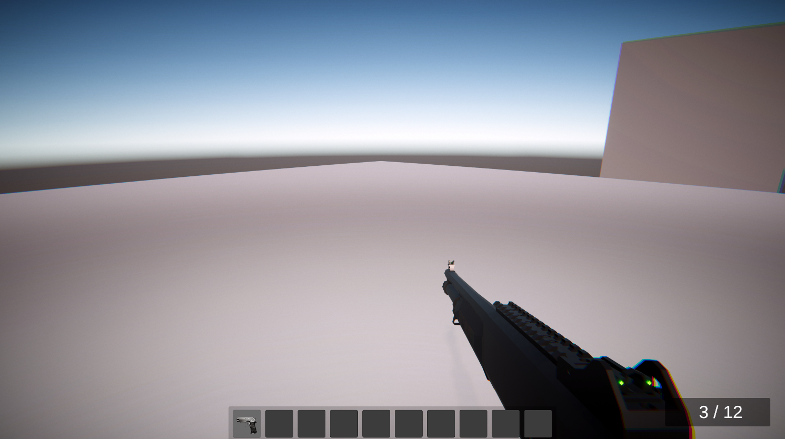
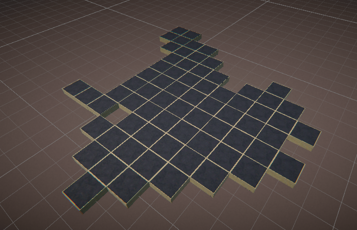
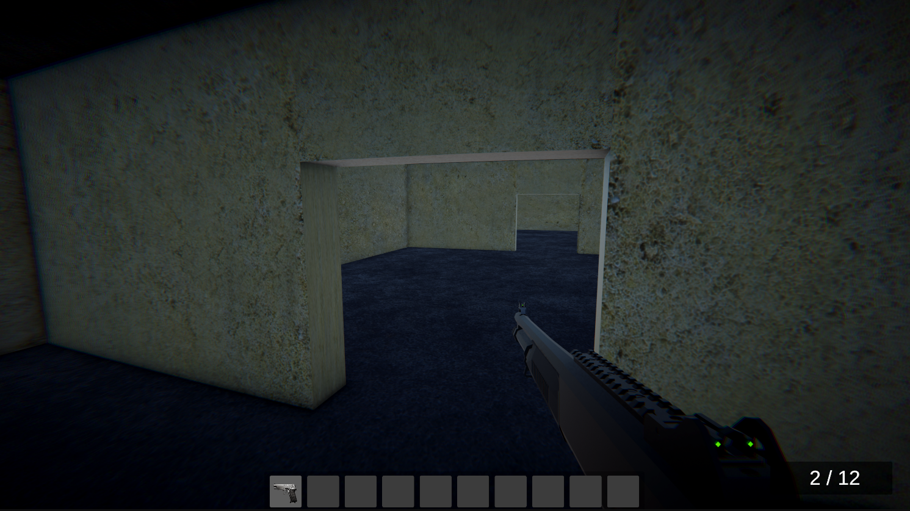

# Unity — The Midnight Complex

> **Projeto de desenvolvimento de jogo em Unity/C# com foco em sistemas de inventário, geração procedural de mapas e persistência de dados.**

Este projeto foi desenvolvido durante a produção de um jogo que posteriormente teve seu desenvolvimento descontinuado. Durante esse processo, foram implementados diversos sistemas fundamentais para o funcionamento do jogo, incluindo inventário, gerenciamento de itens, geração procedural de mapas, conversão de recursos e salvamento/carregamento de dados.

Embora o jogo original não tenha sido concluído, os sistemas desenvolvidos constituem uma parte significativa do trabalho técnico realizado no projeto e permanecem neste repositório como documentação e registro de desenvolvimento.

---

## Instalação e execução

No projeto já existem alguns prefabs prontos, após baixar, é possível abrir com a Unity e encontrar as cenas `Sample Scene` a qual já templates básicos para testar o sistema de inventário e o `RoomGenerator` que por sua vez é a cena template para demonstrar o funcionamento da geração de salas; em ambos os casos, o carregamento com dados persistentes acontecerá assim que a engine entrar em Runtime.


## Sistemas

### Inventory System


O sistema de inventário foi desenvolvido utilizando uma arquitetura baseada em dois níveis de representação:

```text
                    AbstractItem
                         │
              ┌──────────┼──────────┐
              │          │          │
        AbstractGun  AbstractScrap  AbstractAMMO
              │          │          │
              ▼          ▼          ▼
         GunInstance ScrapInstance AMMOInstance
```

Os `AbstractItem` são `ScriptableObject` responsáveis por armazenar a definição dos itens, enquanto as classes `Instance` representam os itens durante a execução do jogo.

Essa separação permite que propriedades estáticas, como o modelo, sprite e ID de um item, sejam mantidas separadas de informações que podem mudar durante a execução.

Um exemplo particularmente relevante é o sistema de armas:

```text
AbstractGun
    │
    ├── Definição da arma
    │
    ▼
GunInstance
    │
    └── Munição atual
```

Assim, diferentes instâncias de uma mesma arma podem possuir estados diferentes sem modificar a definição original do `ScriptableObject`.

Já `InventoryManager` atua como o principal controlador do sistema de inventário, sendo responsável por:

* seleção de slots;
* gerenciamento do item equipado;
* utilização de itens;
* recarga;
* controle de munição;
* coleta de objetos;
* descarte de objetos;
* instanciação dos modelos equipados;
* comunicação com animações;
* persistência do inventário.

---

# Geração de mapa procedural




A geração procedural utiliza uma separação entre a **estrutura lógica do mapa** e sua representação visual.

O processo pode ser resumido em:

```text
Configuration
      │
      ▼
 Seed / Random Generator
      │
      ▼
 Room Graph
      │
      ▼
 Extra Connections
      │
      ▼
 Connection Masks
      │
      ▼
 Room Prefabs
      │
      ▼
 World Generation
      │
      ▼
 Item Spawning
```

A classe `Room` representa uma sala como um nó de um grafo, armazenando suas conexões com as salas vizinhas.

Cada sala possui quatro possíveis direções:

```text
        North
          ↑
          │
West ←── Room ──→ East
          │
          ↓
        South
```
As conexões das salas são representadas através de um `enum` com `[Flags]`:

```text
North = 1
South = 2
East  = 4
West  = 8
```

Isso permite representar múltiplas conexões utilizando uma única variável.

Por exemplo:

```text
North | East

1 | 4 = 5
```

Uma máscara com valor `5` representa uma sala conectada ao norte e ao leste.

Essa informação é utilizada posteriormente para selecionar um prefab compatível com a configuração da sala.

Cada prefab possui um `RoomPrefabData`, que informa:

* quais direções possuem conexões;
* quais pontos podem ser utilizados para spawn.
---

# Save & Load

A persistência foi implementada utilizando JSON através do `JsonUtility` do Unity.

O inventário não salva diretamente os `ScriptableObject`.

Em vez disso, são armazenadas informações suficientes para reconstruir as instâncias posteriormente:

```text
ItemData
├── ID
├── Type
└── Bullets
```

Durante o carregamento, o `InventoryLoader` utiliza o ID salvo para localizar a definição correspondente e reconstruir a `Instance`.

```text
                 Save
InventoryManager ───────► ItemData
                            │
                            ▼
                           JSON
                            │
                            ▼
                      InventoryLoader
                            │
                            ▼
                       AbstractItem
                            │
                            ▼
                         Instance
```

Essa abordagem mantém os arquivos de save independentes das referências diretas aos objetos utilizados pelo Unity.

# Visão geral da lógica pensada:

Os sistemas desenvolvidos se relacionam da seguinte maneira:

```text
                     ┌────────────────────┐
                     │  RoomGenerator     │
                     └─────────┬──────────┘
                               │
                               ▼
                         Procedural Map
                               │
                               ▼
                         Game World
                               │
                     ┌─────────┴─────────┐
                     │                   │
                   Pick-up              Drop
                     │                   │
                     ▼                   ▼
              ┌─────────────┐    ┌──────────────┐
              │  Inventory  │    │  Conversor   │
              │  Manager    │    │  Machine     │
              └──────┬──────┘    └──────┬───────┘
                     │                  │
                     │                  ▼
                     │             UIController
                     │                  │
                     ▼                  ▼
               Inventory           Resources
                  Save                 Save
                     │                  │
                     ▼                  ▼
          inventoryFiles.json       UIData.json
```
